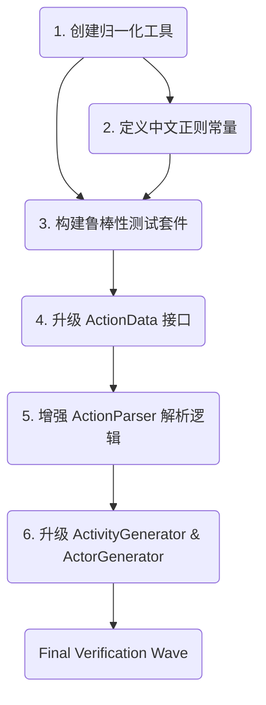

# Phase 2: Activity System & Parsing Robustness

## 目标
对齐远程项目 (5e-statblock-importer) 的语义解析深度，将细粒度的动作数据（AOE 形状/范围、多段伤害、双手伤害、充能、半伤机制）从中文 Markdown 中精准提取并映射到 Foundry V12 的 Activity 数据结构。

## 范围 (Scope)
- **IN**: 
  1. 充能 (Recharge): `[充能 5-6]` -> `uses.recovery`.
  2. AOE 目标 (Target/Area): `60尺锥形`、`30尺线形` -> `target.template`.
  3. 射程/触及 (Range/Reach): `触及 5 尺` -> `range.value`.
  4. 伤害精细化 (Damage Parsing): 多段伤害 (Plus Damage)、双手伤害 (Versatile)、半伤机制 (Half Damage on Save).
  5. 消耗 (Action Cost): `消耗 2 个动作`.
  6. 文本归一化: 处理中文全角标点符号（如 `：`、`（）`）。
- **OUT**: 
  - Midi-QOL 的自动化 Flags（如 OverTime 持续伤害），留到 Phase 3。
  - 纯英文 Parser 的大范围重构（重点聚焦于中文解析的增强）。

## Guardrails (from Metis)
- **MUST**: 实现文本归一化（全角转半角，统一空格），防止因中文排版不一致导致的正则失败。
- **MUST NOT**: 在 Parser 中硬编码凌乱的正则。将正则提取到独立的常量文件 `chineseActionRegex.ts` 中。
- **MUST**: 采用 TDD，先写测试验证正则对不同中文描述的提取，再对接生成器。
- **MUST**: 所有输出比对必须参照实际的 FVTT v12 JSON Schema，不能仅凭肉眼。

---

## Task Dependency Graph



## Parallel Execution Graph (Waves)

| Wave ID | Exec Mode | Tasks ID | Description |
| :--- | :--- | :--- | :--- |
| W1 | Parallel | 1, 2 | 基础设施 (Normalization & Regex) 可以并行开发。 |
| W2 | Sequential | 3 | 构建测试套件，依赖 W1 完成。 |
| W3 | Parallel | 4, 5, 6 | 逻辑实现与生成器升级，严格遵循 TDD 步骤。 |

---

## Delegation Recommendation (Caller TODOs)

### Skills Evaluation
- **Typescript Advanced Types**: Required for creating robust interfaces (`ActionData`) and complex mapping logic (`ChineseActionRegex`).
- **Architecture Designer**: Required for designing the interaction between the new `NormalizationService`, `ActionParser`, and `ActivityGenerator`.
- **Code**: Standard implementation.

### Tasks and Execution Commands (Waves)

#### Wave 1: Research & Pattern Definition
- [x] 1. **Create Normalization Utility**
  - Category: `quick`
  - Skills: `Code`
  - Command:
    ```typescript
    task(category="quick", load_skills=["Code"], run_in_background=false, prompt="Task 1: Create normalize.ts to convert full-width Chinese punctuation to half-width.")
    ```
- [x] 2. **Define Chinese Regex Constants**
  - Category: `unspecified-high`
  - Skills: `typescript-advanced-types`
  - Command:
    ```typescript
    task(category="unspecified-high", load_skills=["typescript-advanced-types"], run_in_background=false, prompt="Task 2: Create chineseActionRegex.ts with localized patterns for AOE, Reach, Range, Damage, Recharge.")
    ```

#### Wave 2: TDD Test Setup
- [ ] 3. **Setup Parser Test Suite**
  - Category: `unspecified-high`
  - Skills: `Code`
  - Command:
    ```typescript
    task(category="unspecified-high", load_skills=["Code"], run_in_background=false, prompt="Task 3: Create chinese-robustness.test.ts with failing tests for AOE, Versatile, Recharge.")
    ```

#### Wave 3: Core Logic Implementation
- [ ] 4. **Enhance ActionData & ActionParser**
  - Category: `ultrabrain`
  - Skills: `architecture-designer`
  - Command:
    ```typescript
    task(category="ultrabrain", load_skills=["architecture-designer"], run_in_background=false, prompt="Task 4 & 5: Expand ActionData interface and implement regex parsing logic in ActionParser using ChineseActionRegex.")
    ```
- [ ] 5. **Upgrade ActivityGenerator & ActorGenerator**
  - Category: `ultrabrain`
  - Skills: `architecture-designer`
  - Command:
    ```typescript
    task(category="ultrabrain", load_skills=["architecture-designer"], run_in_background=false, prompt="Task 6: Update ActivityGenerator to map new ActionData fields (reach, recharge, target, versatile) to FVTT v12 JSON structure.")
    ```

---

## QA Scenarios (Mandatory Verification Steps)

> Each task must be verified by the QA scenario below. A task is not "Done" until its QA scenario passes.

### QA for Task 1 (Normalization Utility)
- **Tool**: `bun test src/core/parser/__tests__/utils/normalize.test.ts`
- **Steps**:
  1. Run the test suite.
  2. Input string containing full-width punctuation: `命中：+5（钝击）`
- **Expected Result**: Output string must contain half-width punctuation: `命中:+5(钝击)`. Test must pass.

### QA for Task 2 (Chinese Action Regex)
- **Tool**: `bun test src/core/parser/__tests__/chinese-regex.test.ts`
- **Steps**:
  1. Run a regex unit test that isolates `ChineseActionRegex.target`.
  2. Pass test string: `覆盖 90 尺锥形区域` (Covers 90-foot cone area)
- **Expected Result**: The regex must capture `areaRange: "90"` and `shape: "锥形"`. Test must pass.

### QA for Task 3 (Parser Test Suite)
- **Tool**: `bun test src/core/parser/__tests__/chinese-robustness.test.ts`
- **Steps**:
  1. Run the suite.
  2. Check that `test('AOE Cone Extraction', ...)` fails because `ActionParser` doesn't extract target yet.
- **Expected Result**: The test suite must **FAIL** (Red phase of TDD).

### QA for Task 4 & 5 (ActionData & ActionParser)
- **Tool**: `bun test src/core/parser/__tests__/chinese-robustness.test.ts`
- **Steps**:
  1. Run the suite.
  2. Check `test('Versatile Damage Extraction', ...)` which parses `14 (2d10+6) 挥砍伤害，双手使用时为 16 (2d12+6)` (Ver 14, two-handed 16).
- **Expected Result**: Test must **PASS**. `actionData.versatileDamage` must contain `16 (2d12+6)`.

### QA for Task 6 (Generators)
- **Tool**: `bun test src/core/generator/__tests__/activity.test.ts`
- **Steps**:
  1. Run the suite.
  2. Pass an `actionData` with `recharge: { value: 5 }` and `target: { shape: 'cone', value: 60 }`.
- **Expected Result**: The generated JSON must have `uses.recovery` mapped to `5` (or the equivalent V12 recharge structure) and `target.template` containing `{ type: 'cone', size: 60 }`.

---

## Final Verification Wave
- [ ] 7. 运行完整单元测试，确保覆盖所有新加的高级特性解析，并且无回归错误。
- [ ] 8. 使用包含所有特性的复杂中文怪物（如之前的“毁灭月石尖啸者”）进行端到端 JSON 生成，验证输出结构的完整性。
- [ ] 9. [DECISION NEEDED] 用户确认 Phase 2 成果，准备进入后续阶段。