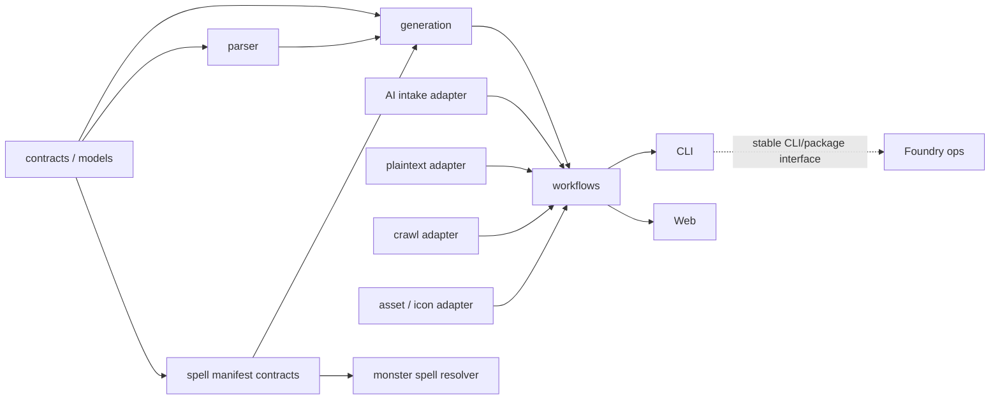

# fvttV12JsonGenerator 项目分类与架构重整计划

- 日期：2026-07-31
- 状态：已批准，正在 `codex/architecture-reorganization-20260731` 分支执行
- 仓库：`I:\OpenCode\fvttV12JsonGenerator`
- 审计基线：`master` @ `64ad9b79c71fdc38d1113e5983dc2394680c4ab9`
- 远端关系：本地 `master` 比 `origin/master` 领先 6 个提交
- 既有治理账本：`docs/remediation/2026-07-15-project-hardening/EXECPLAN.md`
- 当前支持边界：`docs/acceptance/current-support-matrix.md`

## 1. 结论摘要

这个仓库目前不是一个单一产品，而是至少六类东西长期叠加在同一个目录和发布边界中：

1. Markdown/YAML 到 Foundry Actor/Item JSON 的核心转换产品；
2. 多种来源接入器，包括 AI Intake、旧 plaintext、GoddessFantasy 爬取和翻译；
3. 图片、Token、图标解析及人工复核流水线；
4. CLI 与 Web 工作台两个应用入口；
5. 三个 Foundry 运行时模块；
6. Foundry 本地实验室、生产盘点、迁移、诊断、浏览器伴侣等运维产品。

问题不是简单的“文件夹太多”，而是以下边界同时混在一起：

- 产品边界；
- 运行时边界；
- 发布边界；
- 权限与安全边界；
- 依赖方向；
- 源码、内容、证据、参考资料和本地运行数据的存储边界。

推荐方向是：

> **先把当前仓库整理为具有强依赖边界的模块化单体 / Bun workspace，再把真正独立的运维产品和 Foundry 模块逐步拆成独立发布单元；不做一次性重写，也不立即把所有功能拆成多个仓库。**

这样可以保留当前 1,576 个通过的测试作为安全网，先建立稳定接口，再移动目录和拆仓。直接“大搬家”会同时破坏路径、测试夹具、Web/CLI 调用、Foundry 模块构建、Obsidian 工作流和当前未关闭的 remediation 事项，风险远大于收益。

建议最终形成三个层次：

1. **主产品仓库**：转换核心、应用层工作流、CLI、Web 和与转换紧密耦合的 spell manifest contract；
2. **独立扩展产品**：Foundry 模块各自成为独立发布单元；
3. **独立运维产品**：Foundry Lab、world audit、生产迁移和浏览器/本地镜像操作迁往单独的 `fvtt-foundry-ops` 仓库。

## 2. 本计划的完成标准

本计划本身只有同时满足以下条件，才算是一个可执行的重整计划：

- 说明当前项目实际包含哪些产品和功能族；
- 说明当前依赖方向和主要耦合点；
- 明确哪些内容留在主仓库、哪些先模块化、哪些以后拆仓；
- 给出有顺序、有退出条件的迁移阶段；
- 每个阶段分别列出机械验证、语义验收和回滚条件；
- 保留当前 hardening ExecPlan 的未关闭事项与支持声明；
- 不把缓存、参考资料、内容和源码混为一谈；
- 不要求一次性重写；
- 能以小提交、可回退、行为不变的方式开始执行；
- 标出需要用户做产品决策的少量问题。

## 3. 审计范围与方法

### 3.1 已完成的检查

本次审计包含：

- 枚举全部 1,905 个受版本控制路径；
- 按顶层目录、三级功能域、文件类型和体积分类；
- 检查 `package.json` 的应用入口、脚本、依赖和发布元数据；
- 阅读 CLI、Web、crawler、generator、parser、workflow、intake、assets、spell resolver、Foundry modules 和 Foundry Lab 的主要入口；
- 统计生产代码和测试代码的规模及热点文件；
- 检查核心模块之间以及外层应用对核心的导入关系；
- 使用静态工具交叉检查循环依赖、未使用依赖和疑似未使用导出；
- 检查当前分支、合并状态、附加工作树及本地未提交内容；
- 阅读根 `AGENTS.md`、当前 remediation ExecPlan、支持矩阵、artifact policy 和相关 runbook；
- 运行生产类型检查、完整类型检查、仓库卫生检查、anti-overfit 审计和全部测试；
- 调研 Bun workspace、dependency-cruiser、Knip、TypeScript project references、ADR、Git 历史拆分与 monolith-first 实践。

### 3.2 没有伪装成“逐字阅读”的内容

以下内容做了清单、体积、用途和边界检查，但没有逐字逐文件阅读：

- `references/` 中 1,100 多份上游 Foundry API HTML；
- `.local/` 中约 88 GiB 的应用镜像、world、证据、备份和缓存；
- Obsidian 插件本体等第三方 vendored 文件；
- 所有历史证据和旧 agent 记录的正文。

这一区分很重要：它们属于供应商资料、运行状态、证据或历史工件，不应被当作本项目的业务源码来评价架构。

## 4. 当前状态快照

### 4.1 Git 状态

审计时实际状态：

```text
## master...origin/master [ahead 6]
 M docs/remediation/2026-07-15-project-hardening/EXECPLAN.md
?? obsidian/dnd数据转fvttjson/images/
```

结论：

- 当前确实在 `master`；
- 本地有 6 个尚未推送的提交；
- ExecPlan 有用户已有修改；
- `images/` 是已有未跟踪目录；
- 这些内容在本次审计中均视为用户工作，不覆盖、不清理；
- 本计划是本次新增的唯一持久文件。

所有本地分支的提交目前都已并入 `master`，但仍保留多个旧分支和附加 worktree。它们不能仅凭“已合并”自动删除；必须逐个检查 worktree 是否脏、是否存在仅本地工件，再做归档和清理。

最近 6 个本地提交也直接解释了功能为何迅速聚集：

| Commit | 内容 |
|---|---|
| `64ad9b7` | guarded classpack v14 migration |
| `b1a2fbe` | session performance monitor |
| `2152269` | safe name-driven v14 item icons |
| `709eac4` | 非常规怪物机制转换示例手册 |
| `84364ff` | 溟渊怪物高级机制契约 |
| `82c64dd` | 怪物资源与行为语义解析 |

这些提交同时涵盖运维迁移、运行时监控、图标系统、文档契约和 generator 语义，说明当前问题确实是发布/产品边界不足，而不只是某一个目录没有整理好。

审计时的附加 worktree：

| Worktree | 分支/状态 |
|---|---|
| `C:\Users\Administrator\.codex\worktrees\abc2\fvttV12JsonGenerator` | detached |
| `...\bloodfin-acceptance-gate` | `bloodfin-acceptance-gate` |
| `...\goddessfantasy-clean-merge` | `codex/goddessfantasy-clean-merge` |
| `...\item-generation-workflow-repair` | `codex/item-generation-workflow-repair` |
| `...\npc-monster-workflow-repair` | `codex/npc-monster-workflow-repair` |
| `...\tailcrash-heavy-hit` | `codex/tailcrash-heavy-hit` |
| `I:\OpenCode\fvttV12JsonGenerator\.worktrees\actor-refactor` | `codex/actor-refactor` |

`git branch --no-merged master` 当前为空；所有已列出的本地 topic branch 都已由 `master` 可达。这里记录的是提交可达性，不是 worktree 内容已经可以安全删除的证明。

### 4.2 机械健康基线

以下命令在当前基线通过：

```text
bun run typecheck:production
bun run typecheck:all
bun run hygiene:repository
bun run audit:anti-overfit:all
bun test --max-concurrency 4
```

结果：

- 仓库卫生检查覆盖 1,905 个 tracked paths；
- anti-overfit 审计覆盖 205 个源文件；
- 1,576 个测试通过；
- 0 个测试失败；
- 7,451 个断言；
- 149 个测试文件；
- 测试耗时约 52 秒。

这证明当前仓库适合做渐进式重构，但不能证明架构已经合理，也不能证明所有运行时/生产支持已完成。支持矩阵中仍有 `Partial` 项，ExecPlan 中也仍有在办、延期和外部阻塞事项。

### 4.3 规模

主要受版本控制目录：

| 区域 | 文件数 | 角色 |
|---|---:|---|
| `references/` | 1,195 左右 | 版本锁定的上游 API、schema 和 provenance |
| `src/` | 337 | 主产品、Web、工具、Foundry 模块源码 |
| `obsidian/` | 128 | 工作输入、内容、插件配置及少量显式验收输出 |
| `docs/` | 97 | 计划、验收、runbook、审查和治理账本 |
| `scripts/` | 46 | Foundry Lab、构建和运维脚本 |
| `.sisyphus/` | 38 | 历史 agent 计划、证据和 notepad |
| `tests/` | 约 26 | 跨域和顶层测试 |
| `data/` | 约 18 | 数据库、DOCX 和内容工件 |

主要源码区域：

| 区域 | 文件数 | 行数 | 观察 |
|---|---:|---:|---|
| `src/core` | 186 | 50,234 | 实际上包含多个层次，不是单一“core” |
| `src/tools` | 43 | 15,312 | 爬虫、world audit、内容和运维工具混合 |
| `scripts/foundry-lab` | 35 | 12,691 | 已经是一个独立的运维产品 |
| `src/foundry` | 52 | 12,209 | 三个不同用途、不同耦合度的 Foundry 模块 |
| `src/web` | 21 | 5,578 | Web 应用和服务端 job/API |

最大热点：

| 文件 | 行数 | 主要风险 |
|---|---:|---|
| `src/core/generator/actor.ts` | 3,311 | actor 投影、规则、localization 和目标细节仍过度集中 |
| `scripts/foundry-lab/bloodHunterHomebrew.ts` | 1,876 | 专项迁移逻辑过大 |
| `src/core/parser/item-parser.ts` | 1,552 | 解析职责和特殊结构集中 |
| `src/foundry/monster-spell-resolver/hooks.ts` | 1,470 | Foundry 生命周期、UI 和业务编排集中 |
| `src/tools/world-audit/inventory.ts` | 1,458 | inventory 与分析逻辑集中 |
| `src/core/ingest/plaintext.ts` | 1,330 | 旧格式接入和转换规则混合 |
| `src/core/generator/actor-text.ts` | 1,306 | 文本生成职责过大 |
| `src/core/intake/validator.ts` | 1,305 | Intake schema、规则和诊断集中 |
| `src/core/intake/orchestrator.ts` | 1,255 | 编排器承担过多流程状态 |
| `src/tools/world-audit/report.ts` | 1,153 | 报告模型与渲染集中 |
| `src/core/parser/english.ts` | 1,111 | 英文来源解析集中 |
| `src/web/client/App.tsx` | 1,036 | 客户端页面与状态未分区 |

### 4.4 物理存储与版本库体积

受版本控制内容约：

- `references/`：72.73 MiB；
- `obsidian/`：11.11 MiB；
- `data/`：8.32 MiB；
- `src/`：3.15 MiB；
- `docs/`：1.47 MiB；
- Git object store：约 302 MiB。

工作区内未跟踪/忽略的 `.local/` 约 88.4 GiB、227,000 多个文件，其中主要是：

- Foundry v14 evidence：约 46.9 GiB；
- Foundry v14 data mirror：约 23.9 GiB；
- backups：约 3.0 GiB；
- scratch：约 2.3 GiB；
- archives：约 1.6 GiB；
- 其他本地服务、旧快照、参考源码和缓存。

它们不是 Git 污染，但把源码仓库同时变成了运行数据盘、证据库、备份区和缓存区。这个布局提高了误操作、备份成本、索引噪声和工具扫描成本。清理必须先做 manifest、hash、保留策略和可恢复性检查，不能在架构整理中顺手删除。

## 5. 当前功能分类

### 5.1 核心转换领域

主要路径：

- `src/core/models`
- `src/core/parser`
- `src/core/mechanics`
- `src/core/generator`
- `src/core/generation`
- `src/core/verification`
- `src/core/workflow`

职责：

- 解析中文 YAML/Markdown 和英文 bestiary 风格 Markdown；
- 建立内部 actor/item 表达；
- 推导有来源依据的 mechanics；
- 投影到 Foundry v12 / v14、dnd5e 和相应 module profile；
- 生成诊断与验证结果；
- 编排单文件、collection 和同步工作流。

判断：这是主产品的核心，应留在主仓库，但必须拆出明确的领域层和应用层，不应继续把所有东西都放在 `src/core`。

### 5.2 来源接入器

主要路径：

- `src/core/ingest`
- `src/core/intake`
- `src/core/crawl`
- `src/tools/crawlSites.ts`
- 翻译相关模块

职责：

- 旧 plaintext Actor/Item 接入；
- AI Intake、暂停/恢复和证据校验；
- GoddessFantasy board/thread 抓取；
- crawl records 到 plaintext；
- 待翻译 JSON 处理。

判断：这些是进入核心工作流的 adapter，不是核心领域本身。它们应依赖稳定的 workflow port，核心 generator 不应反向依赖 intake 或 crawl。

### 5.3 资产、Token 与图标流水线

主要路径：

- `src/core/assets`
- `src/core/icons`
- CLI 中的图片上传、裁切、review、icon catalog 模式

职责：

- 图片上传和 SSH 资产路径；
- Token 裁切、contact sheet 和人工复核；
- v14 icon catalog、解析、置信度与 review；
- actor art 与 token art 路由。

判断：它们属于可选生产 adapter。应成为独立 package，通过显式 asset/icon port 接入 workflow；不应散落在 CLI 分支和 generator 内部。

### 5.4 应用入口

主要路径：

- `src/index.ts`
- `src/web/server`
- `src/web/client`

现状：

- `src/index.ts` 约 380 行，同时处理普通转换、sync、翻译、AI Intake、旧 plaintext、图片、Token 和 icon 模式；
- Web server 直接导入多个 core 内部模块；
- Web client 的 `App.tsx` 和样式文件已经超过 1,000 行；
- 根 `package.json` 的 `module` 指向根 `index.ts`，但根 `index.ts` 只是 `console.log("Hello via Bun!")`，与真实入口 `src/index.ts` 不一致。

判断：CLI 和 Web 是两个应用，不应继续伪装成 core 的一部分。根发布元数据是一个应优先修正的事实错误。

### 5.5 Foundry 运行时模块

#### `monster-spell-resolver`

- 与 generator 的 portable spell manifest、spell-resolution contract 和 intake/parser 有实质耦合；
- 当前不适合立即拆出；
- 应先提取一个窄的 `spell-manifest-contracts` 接口包；
- 等 contract 稳定并有跨包契约测试后，再决定独立仓库。

#### `chat-memory-guard`

- 与转换产品基本独立；
- 有自己的 module metadata、运行时和验收边界；
- 是较好的首批独立发布单元候选。

#### `session-monitor`

- Foundry module 与 Windows/Chrome companion 构成一个独立产品；
- 目前只因复用一个通用 `sha256` 实现而触及 spell-resolution；
- 应把小型 hash 能力本地化或放入真正通用的 contract/util package；
- 适合在第二批拆出。

### 5.6 Foundry 运维产品

主要路径：

- `scripts/foundry-lab`
- `src/tools/world-audit`
- production inventory/acquisition/migration 脚本
- 本地 mirror、classpack、Blood Hunter、Plutonium、Sequencer 等专项工具

职责范围已经包括：

- 本地 Foundry 镜像安装与启动；
- module build/install；
- world 准备与恢复；
- 生产 inventory、包获取和诊断；
- classpack 和 homebrew 迁移；
- 浏览器辅助和运行时验收；
- 大量高权限、环境相关操作。

判断：这已经是独立运维产品，而且安全边界与 JSON generator 不同。推荐最终拆到 `fvtt-foundry-ops`。在拆仓前先在本仓库内收拢到 `tools/foundry-ops`，建立命令入口、配置和证据接口，避免直接复制散落文件。

### 5.7 内容、参考资料、证据与历史工件

| 类型 | 当前路径 | 建议 |
|---|---|---|
| Obsidian 输入与内容 | `obsidian/dnd数据转fvttjson` | 第一轮保持兼容，不立即搬迁 |
| 默认生成输出 | vault 内 `output/` | 继续由 CLI 产生，维持 hygiene 规则 |
| 显式验收输出 | 少量 allowlist 文件 | 保留并记录原因 |
| 上游版本 provenance | `references/` | 保留小型 manifest、锁定信息和必要快照 |
| 完整上游源码/cache | `.local/references` 等 | 留在版本库外，改为可配置的外部根目录 |
| Foundry data/world/evidence | `.local/foundry-v14` | 迁到可配置的 lab root，不作为源码树子目录 |
| 历史 agent 资料 | `.sisyphus/` | 先做消费者审计，再归档或删除 |
| runbook/验收/决策 | `docs/` | 重组索引，保留可追溯性 |

## 6. 当前依赖与架构问题

### 6.1 外层到内层的方向大体正确

正面现状：

- `src/core` 的生产代码没有反向导入 `src/web`、`src/foundry` 或 `src/tools`；
- Web、CLI、Foundry module 和 tools 总体上是 core 的消费者；
- 现有测试规模足以支持 characterization-first 的渐进重构。

### 6.2 `core` 内部层次模糊

已观察到的双向或循环式耦合：

- `generation` ↔ `workflow`
- `generation` ↔ `generator`
- `intake` → `workflow`，同时 `workflow` → `intake`
- `generator` 直接接触 parser、models、mechanics、intake、generation、icons 等多个层次

核心问题是 `core` 同时容纳：

- 领域模型；
- 来源解析；
- Foundry schema 投影；
- 应用编排；
- 外部接入；
- 资产处理；
- AI intake；
- 运行时兼容信息。

这导致“只要放进 core 就可以互相导入”，缺少可执行的边界。

### 6.3 三个已机械确认的循环

1. `src/core/spell-resolution/types.ts` ↔ `src/core/intake/types.ts`
   - `EvidenceRef` 与 `PortableSpellRef` 放置层次不当；
   - 应移动到零业务依赖的 contract 层。

2. `src/core/assets/tokenReview.ts` ↔ `tokenReviewContactSheet.ts`
   - contact sheet 反向依赖 orchestrator 的 `TokenReviewItem`；
   - 应提取 review model，渲染器只依赖 model。

3. `src/foundry/monster-spell-resolver/foundry-adapter.ts` ↔ `settings-app.ts`
   - settings UI 反向导入 adapter 的诊断投影和 runtime API；
   - 应定义 settings presenter/service port，由 composition root 注入。

这三个循环都可以先修复，不需要搬整个目录。

### 6.4 高影响调用面

`convertMarkdownContentToJson` 至少被 7 个直接调用点使用，覆盖：

- CLI；
- collection；
- intake；
- Web；
- 其他转换工作流。

其变更可影响 5 个模块和约 19 个上游符号，是当前最重要的稳定应用接口候选。

相比之下：

- Web `runJob` 的上游影响较低；
- `planSpellHydration` 主要影响 monster spell resolver；
- GoddessFantasy crawl 的核心入口只有 CLI tool 和 Web job 两个直接消费者。

因此应优先建立统一的 conversion application service，而不是先按文件夹机械拆分。

### 6.5 依赖与入口卫生

静态检查候选：

- `marked` 在 package/lock 之外没有实际引用，疑似未使用依赖；
- `domhandler` 被源码直接做类型导入，但未在 package manifest 直接声明，当前依靠 transitive dependency；
- Knip 报告约 50 个疑似未使用导出，但其中可能包含测试入口、动态入口和公共 API 假阳性。

处理原则：

- 先配置真实 entry/project patterns；
- 先形成 report-only baseline；
- 每个候选做调用方和动态加载检查；
- 不允许根据一次 Knip 输出批量删除。

## 7. 目标架构

### 7.1 第一目标：模块化 workspace

建议的仓库结构：

```text
apps/
  cli/
  web/

packages/
  contracts/
  models/
  parser/
  generation/
  workflows/
  intake-ai/
  ingest-plaintext/
  crawl-goddessfantasy/
  assets-icons/
  spell-manifest-contracts/

foundry-modules/
  monster-spell-resolver/
  chat-memory-guard/
  session-monitor/

tools/
  foundry-ops/
  world-audit/
  repository/

content/
  # 可选的未来位置；第一轮继续兼容 obsidian/ 原路径

references/
  manifests/
  locks/
  snapshots/

docs/
  architecture/
  decisions/
  plans/
  runbooks/
  acceptance/
  remediation/
```

注意：

- 这是目标信息架构，不是第一批提交要一次性创建的目录；
- `generation` 第一轮同时容纳 actor/item 投影，不立刻为了“看起来纯净”拆得过细；
- `models` 与 `contracts` 只有在依赖规则清楚时才分开；如果边界不足，可以先合为 `contracts`；
- Obsidian vault 第一轮不移动，以免破坏默认 CLI 路径和用户工作习惯；
- Foundry Lab 先收拢到 `tools/foundry-ops`，成熟后再拆仓。

### 7.2 强制依赖方向



规则：

1. `contracts/models` 不依赖其他业务 package；
2. parser 只负责从来源到明确中间表达，不调用 Web、AI、asset 或 Foundry runtime；
3. generation 只依赖 contract/model、parser output 和版本锁定的 schema adapter；
4. workflows 编排 use case，但不承担来源解析细节；
5. AI、plaintext、crawl、asset/icon 是外部 adapter，通过 port 进入 workflow；
6. CLI 和 Web 只调用公开 application service，不导入 generator 内部文件；
7. Foundry modules 只依赖窄 contract，不依赖完整 intake/workflow；
8. Foundry ops 不直接穿透 generator 内部实现，只使用 CLI、package API 或显式 artifact contract；
9. package 间禁止相对路径穿透；
10. 测试可以有受控例外，但例外必须在规则文件中解释。

### 7.3 发布边界

| 单元 | 初始 Git 位置 | 最终发布策略 |
|---|---|---|
| generator CLI | 主仓库 | 独立 app/package |
| Web workbench | 主仓库 | 独立 app |
| contracts/parser/generation/workflows | 主仓库 | workspace packages，内部或版本化发布 |
| monster spell resolver | 主仓库 | contract 稳定后再决定拆仓 |
| chat memory guard | 主仓库起步 | 独立 module artifact，优先拆仓候选 |
| session monitor + companion | 主仓库起步 | 一个独立产品和发布流程 |
| Foundry ops | 先在主仓库收拢 | 独立私有/运维仓库 |
| content/vault | 暂留主仓库 | 后续根据协作方式决定 content repo |
| full runtime/cache/evidence | Git 外 | 外部可配置 data root |

## 8. 工具与治理建议

### 8.1 立即采用

#### Bun workspaces

用途：

- 表达本地 package 边界；
- 允许显式 workspace dependency；
- 保留当前 Bun 工具链；
- 不引入新的构建平台。

它只解决 package 组织，不会自动执行架构规则。

#### dependency-cruiser

用途：

- 声明 forbidden dependency rules；
- 禁止跨层反向依赖和跨 package 私有路径导入；
- 检测循环；
- 在 CI 中作为结构门禁；
- 生成架构图用于审查。

这是本项目第一阶段最合适的架构边界工具。

#### Knip

用途：

- 查找未使用文件、依赖、导出；
- 发现 manifest 漂移；
- 为清理提供候选清单。

初始必须是 report-only，并配置 CLI、Web、Foundry module、Bun scripts、动态 import 和测试入口。不能把输出当作自动删除指令。

#### Madge 或 Knip cycle

用途：

- 在 dependency-cruiser 规则建立前提供简单循环基线；
- 把当前 3 个循环固定为“不得增加”的基线，再逐步降到 0。

长期可以只保留 dependency-cruiser，避免重复工具。

#### ADR

在 `docs/decisions/` 保存短小 Architecture Decision Record：

- 主仓库与 ops 仓库边界；
- 是否拆 content repo；
- workspace package 划分；
- v12/v14 schema adapter 策略；
- Foundry module 发布策略；
- 本地 runtime/evidence root 策略。

架构决策不应只留在聊天或计划中。

### 8.2 有条件采用

#### GitNexus

本次试用证明：

- 精确 symbol context 和 impact analysis 有价值；
- 但默认索引把 tracked `references/`、忽略的 `.local/` 和上游源码纳入了图；
- 这会制造错误 cluster 和虚假的跨域 execution flow；
- force 重建后全文索引仍报告 FTS 缺失。

只有满足以下条件才纳入正式流程：

- 建立严格 `.gitnexusignore`；
- 仅索引本项目源码、测试和必要配置；
- 解决当前版本的 FTS 兼容问题；
- 用几个已知调用链验证 graph 准确性。

在此之前，它只能做辅助 impact 查询，不能作为架构事实来源。

#### TypeScript project references

可以在 package 稳定后评估，但不在第一阶段强制使用。当前项目大量使用 `noEmit`；project references 的 `composite`/declaration 输出需要单独设计，过早加入会把目录整理变成构建系统迁移。

#### Nx

如果未来出现以下痛点再评估：

- workspace package 明显增加；
- CI 时间成为主要瓶颈；
- 需要 affected-only test/build；
- 需要远程缓存或任务图。

当前只为目录和边界整理引入 Nx 成本过高。Bun workspace + dependency-cruiser 足够。

### 8.3 明确不采用

- 不把当前产品拆成微服务；
- 不做 framework-driven rewrite；
- 不把所有共享代码塞进无边界的 `utils` 或 `common`；
- 不用自动工具批量搬文件或批量删除导出；
- 不在活跃仓库上直接改写 Git 历史；
- 不把运行时 88 GiB 数据提交或迁入新的源码 package。

## 9. 分阶段实施计划

## 9.1 阶段 0：确认边界并冻结迁移基线

### 目标

在移动任何源码前，确认产品拆分方向，并记录当前行为和未关闭事项。

### 工作

1. 为本计划做一次用户决策审查；
2. 新建 ADR：
   - 模块化单体优先；
   - Foundry ops 最终独立；
   - Foundry modules 独立发布单元；
   - vault 第一轮保持路径兼容；
3. 在新架构 ledger 中映射所有现有 ExecPlan findings：
   - `MOD-I18N-001`
   - `SPELL-002`
   - `SPELL-003`
   - `BH-ACT-003`
   - `MON-001`
   - `SEQ-MEM-001`
   - `WORLD-ASSET-001`
4. 保存当前 support matrix，不因移动目录升级任何 `Partial` 声明；
5. 为关键应用入口建立行为清单：
   - 单文件转换；
   - collection/sync；
   - AI Intake；
   - crawl-to-plaintext；
   - Web job；
   - spell manifest 与 resolver；
   - module build；
   - Foundry Lab 主要命令。

### 机械验证

- 当前完整 baseline 命令继续通过；
- 所有 open finding 都能在迁移 ledger 中找到新 owner；
- ADR 和 ledger 链接均有效。

### 语义验收

- 每个现有用户工作流都有明确归属；
- 没有任何功能因“不好分类”而被默认为废弃；
- “代码整理”与“修复未完成功能”仍是两条独立工作流。

### 回滚

此阶段只有文档变化，可逐文件撤回；不修改产品行为。

## 9.2 阶段 1：先装护栏，不移动大目录

### 目标

先让边界和漂移可见，再开始迁移。

### 工作

1. 修正根 `package.json` 的真实入口或删除误导性的 `module` 字段；
2. 判定并处理 `marked`；
3. 将 `domhandler` 设为直接依赖或改用已声明的公开类型；
4. 配置 dependency-cruiser；
5. 配置 Knip 的真实 entry/project patterns，先生成 baseline；
6. 加入循环依赖基线，禁止新增循环；
7. 修复三个已知循环：
   - spell/intake type；
   - token review/contact sheet；
   - resolver adapter/settings app；
8. 为关键 public facade 定义命名和导出规则；
9. 在 CI/本地检查中加入结构门禁，但第一批只阻止“新增违规”，不要求一次清零所有历史违规。

### 建议提交拆分

1. `chore: align package metadata and dependency declarations`
2. `build: add architecture boundary reports`
3. `refactor: remove baseline dependency cycles`

### 机械验证

- 全部现有 baseline 通过；
- 循环由 3 降到 0，或每个暂存例外有明确说明和到期条件；
- dependency-cruiser 不出现新增违规；
- Knip baseline 可重复运行；
- `git diff --check` 通过。

### 语义验收

- CLI、Web 和三个 Foundry module 的实际入口仍能构建/启动到原有验收点；
- 普通 actor 转换的输出结构和语义保持不变；
- spell resolver 的设置界面和 hydration plan 行为不变；
- token review contact sheet 内容和关联关系不变。

### 回滚

- 工具规则和循环修复分提交；
- 任一行为回归时可独立撤销相关循环修复；
- 不使用全仓格式化，避免不可读 diff。

## 9.3 阶段 2：建立稳定应用接口

### 目标

在物理移动前建立可替换的 API seam。

### 工作

1. 建立统一 conversion application service：
   - 输入来源；
   - target/version/profile；
   - diagnostics；
   - artifact result；
   - verification result；
2. 将 `convertMarkdownContentToJson` 的 7 个调用方逐步迁到 facade；
3. 为 collection、sync、Web job 和 AI Intake 建立明确 use-case port；
4. 提取零业务依赖的 contracts：
   - `EvidenceRef`
   - target metadata
   - diagnostic/result
   - artifact identity
   - portable spell manifest 最小合同；
5. generator 内部文件不再被 apps/tools 直接导入；
6. 建立 package-level characterization tests，锁定 facade 的输入、输出、诊断和失败语义。

### 机械验证

- 直接跨层导入数量下降并有可量化报告；
- 7 个调用方全部通过 facade；
- 原结构相等检查继续通过；
- 全量测试、类型检查、anti-overfit、hygiene 通过。

### 语义验收

至少抽查：

- 一个中文 YAML/Markdown Actor；
- 一个英文 bestiary Actor；
- 一个带法术/manifest 的 Actor；
- 一个 item workflow；
- 一个 AI Intake；
- 一个 crawl 记录进入 plaintext 再进入生成器；
- 一个 Web job。

必须按照 `docs/generated-actor-verification.md` 核对来源语义，而不是只比较 JSON 可解析或测试通过。

### 回滚

- facade 先委托旧实现；
- 调用方逐个迁移；
- 保留旧入口一个短暂兼容期；
- 只有全部调用方和语义验收完成后才删除兼容入口。

## 9.4 阶段 3：在同一仓库内迁为 Bun workspace

### 目标

把已经形成的逻辑边界变成物理 package，仍保持单仓库和原有行为。

### 推荐顺序

1. `packages/contracts`
2. `packages/parser`
3. `packages/generation`
4. `packages/workflows`
5. `apps/cli`
6. `apps/web`
7. `packages/intake-ai`
8. `packages/ingest-plaintext`
9. `packages/crawl-goddessfantasy`
10. `packages/assets-icons`
11. `packages/spell-manifest-contracts`

每次只移动一个可独立验证的边界。禁止同一提交同时：

- 搬目录；
- 重命名大量符号；
- 改变 mechanics；
- 更新生成 JSON；
- 做无关格式化。

### 路径兼容

- CLI 参数和默认 vault 路径保持不变；
- 必要时保留薄转发入口；
- Web API route 和 job schema 保持不变；
- module build 输出路径在正式切换前维持兼容；
- `docs/generated-actor-verification.md` 仍是生成物验收入口。

### 机械验证

- workspace install 可重复；
- 每个 package 有明确 manifest、entry 和 typecheck；
- 根级完整测试继续通过；
- dependency-cruiser 强制依赖方向；
- 没有 package 通过 `../../..` 穿透到另一 package 私有实现；
- 构建产物和 ignore 规则符合 artifact policy。

### 语义验收

- 阶段 2 的跨工作流样本全部重新生成并核对；
- Web 操作与 CLI 对同一来源给出等价结果；
- v12 core、v14 core 以及已宣称的 modded profile 不因移动目录改变语义；
- 当前支持矩阵的 `Pass/Partial` 状态不发生未经证据支持的变化。

### 回滚

- 每个 package 独立迁移提交；
- 迁移期间保留路径 adapter；
- 若一个 package 不能单独验收，则撤回该 package 的移动，不阻塞其他已完成边界。

## 9.5 阶段 4：拆分独立扩展与运维产品

### 4A. Chat Memory Guard

条件：

- 无主产品私有导入；
- module build、metadata 和运行时验收独立；
- 文档和版本号自洽。

动作：

- 先成为独立 workspace package/release；
- 运行一轮真实本地 Foundry 验收；
- 再用 fresh clone + `git filter-repo` 提取保留历史；
- 建立上游 contract 或 artifact 引用，不复制主产品内部代码。

### 4B. Session Monitor

条件：

- module 与 companion 的协议有版本；
- hash 等小能力不依赖 spell-resolution；
- Windows/Chrome 权限和配置边界文档完整；
- module 与 companion 有端到端握手验收。
- 超过 30 分钟的 Chrome/Foundry/Session Monitor 持续监测不由代理启动、等待或代跑；
  四小时真实跑团属于用户在实际游戏期间执行的外部验收，代理只准备流程并在事后分析导出证据。

动作：

- 作为一个产品拆出，而不是把 module 和 companion 分成两个无人维护的仓库。

### 4C. Foundry Ops

范围：

- Foundry Lab；
- world audit；
- production inventory/acquisition；
- classpack/homebrew/module diagnosis；
- 本地 mirror 管理；
- 高权限远程和浏览器辅助流程。

拆出前必须：

- 把命令收敛到一个明确 CLI；
- 区分 read-only inventory、local mutation 和 production mutation；
- 将凭证、host、world、backup/evidence root 外部配置化；
- 把 generator 依赖收敛为 CLI/package contract；
- 为所有当前 open ExecPlan finding 指定迁移后的 owner；
- 保留 inventory-first、backup-first 和生产单独授权规则。

### 4D. Monster Spell Resolver

不作为首批拆仓对象。只有满足以下条件再决定：

- `spell-manifest-contracts` 稳定；
- generator 与 module 双方有契约测试；
- resolver 不再导入 intake/parser 私有实现；
- v12/v14 和 module-version 证据链独立完整；
- Actor-level all-or-nothing、rollback、manual edit policy 的验收仍通过。

### 拆仓机械验证

- fresh clone 可独立安装、构建、测试和打包；
- Git 历史提取可审查；
- 新仓库没有依赖旧仓库的相对路径；
- 发布 artifact 与拆分前可比较；
- 原仓库删除只发生在新仓库验收之后。

### 拆仓语义验收

- 在目标 Foundry 版本中执行真实运行时验收；
- module/companion/ops 的用户操作流程可独立完成；
- runbook 不再要求读另一个仓库的内部源码才能操作；
- 生产能力仍保持原权限门禁，不因拆仓扩大权限。

### 回滚

- 先镜像、后切换、最后删除；
- 保留一个发布周期的旧路径转发或冻结副本；
- 不在活跃工作副本上直接执行历史改写；
- 使用 fresh clone 执行 `git filter-repo`，验证后再设置新 remote。

## 9.6 阶段 5：数据、参考资料与本地运行根目录治理

### 目标

让源码树不再兼任 88 GiB 的运行数据盘，同时不丢证据和可恢复性。

### 工作

1. 定义可配置的 `FVTT_LAB_ROOT` 或同等专用环境变量；
2. 为以下类别分别建立 manifest：
   - app binaries；
   - Data/modules/systems/worlds；
   - backups；
   - evidence；
   - archives；
   - scratch/cache；
3. 记录来源、版本、hash、最后使用时间、可重建性和保留级别；
4. 将可重建 cache 与不可替代 evidence 分开；
5. 对重复 world、archive 和 upstream cache 做只读 dedupe 报告；
6. 获得用户确认后才执行迁移或删除；
7. `references/` 逐步变成：
   - manifest/lock/provenance 常驻 Git；
   - 必须用于离线验证的最小 snapshot 常驻 Git；
   - 完整上游源码和大缓存位于外部 root；
8. 为离线环境提供明确的 bootstrap/cache-check 命令。

### 机械验证

- 所有当前工具可从新 root 解析相同资源；
- manifest hash 与实物匹配；
- baseline 测试不依赖旧 `.local` 绝对布局；
- 迁移前后文件数与关键目录体积有对账；
- 备份恢复抽样成功。

### 语义验收

- 本地 Foundry mirror 仍可启动到原验收点；
- resolver/module/world 验收能找到正确版本；
- 不可重建证据和用户 world 未丢失；
- 离线工作流仍能完成。

### 回滚

- 第一轮使用复制 + 验证，不直接移动；
- 旧路径保留只读兼容窗口；
- 删除必须作为独立、显式授权的后续任务；
- 所有删除目标使用已解析绝对路径，不使用宽泛 glob。

## 9.7 阶段 6：文档、历史工件、分支与 worktree 治理

### 文档

建立索引：

```text
docs/architecture/README.md
docs/decisions/README.md
docs/runbooks/README.md
docs/acceptance/README.md
docs/remediation/README.md
docs/archive/README.md
```

规则：

- ExecPlan 继续是原 hardening program 的权威账本；
- 新架构迁移使用独立 ledger，不篡改旧 finding 历史；
- 旧 review/plan 在确认不再活跃后移入 archive；
- `.sisyphus/` 先检查是否仍被工具或 runbook 引用，再决定保留、归档或删除；
- 每个当前支持声明必须能追到 acceptance 文档和证据。

### 分支与 worktree

当前旧分支均已合并到 `master`，但存在多个附加工作树，包括 actor refactor、GoddessFantasy、item workflow、NPC/monster workflow、Tailcrash 和 Bloodfin 等历史工作树。

清理流程必须是：

1. `git worktree list --porcelain` 保存快照；
2. 逐个 worktree 检查 `git status --short`；
3. 检查未跟踪文件和仅本地证据；
4. 确认 branch tip 被 `master` 可达；
5. 将需要保留的用户文件显式归档；
6. 先移除 worktree；
7. 再删除已合并本地分支；
8. 最后 prune；
9. 不自动删除 remote branches。

未来分支策略：

- 一个架构 milestone 一个短生命周期分支；
- 一个提交只做一种结构变化；
- 不同时维护多个重叠 refactor worktree；
- 停止点必须更新迁移 ledger；
- 合并后尽快关闭 worktree；
- 未验证的结构迁移不直接堆积在 `master`。

### 机械验证

- 所有保留文档都有索引；
- 无断链的内部文档链接；
- worktree 清理前后有清单；
- 所删分支 tip 均可从保留 refs 到达；
- 主工作树中的用户修改未被触碰。

### 语义验收

- 新线程能从根 `AGENTS.md`、架构索引、ExecPlan、支持矩阵和迁移 ledger 恢复真实状态；
- 文档明确区分“历史完成”“当前部分支持”“未来计划”；
- 不因归档而失去 bug、版本或生产操作证据。

## 9.8 阶段 7：最终架构验收

只有以下条件同时满足，才能称为重整完成：

### 机械层

- 全量测试、类型检查、coverage、hygiene、anti-overfit 通过；
- 循环依赖为 0；
- dependency-cruiser 无未解释违规；
- Knip 没有未经分类的高置信 unused dependency/file；
- 所有 workspace package 可独立 typecheck/build；
- CLI、Web、三个 module 和 ops 均有明确构建入口；
- 工作区没有因迁移产生的临时 artifact；
- branch/worktree ledger 与实际 Git 状态一致。

### 语义层

- 中文 Actor、英文 Actor、Item、Intake、crawl、assets/icons、Web、spell resolver 的代表工作流均通过人工核对；
- 生成 JSON 继续按照 `docs/generated-actor-verification.md` 做来源语义验收；
- v12/v14 和各 module profile 的声明只基于锁定版本证据；
- Foundry module 在目标 runtime 中实际工作；
- Foundry ops 的 read-only、local mutation、production mutation 权限界限清楚且生效；
- 当前 support matrix 没有被目录变化虚假升级；
- 所有旧 open finding 都已关闭、明确延期，或带真实外部 blocker 转交给新 owner；
- 新开发者能明确回答“这个功能属于哪个产品、应依赖哪个接口、如何验收、由谁发布”。

## 10. 优先级和推荐执行切片

### 第一执行切片：只做护栏与事实修正

建议用户批准后，第一轮严格限制为：

1. package 入口和依赖声明修正；
2. dependency-cruiser/Knip/cycle baseline；
3. 三个循环依赖修复；
4. ADR 和迁移 ledger；
5. 不移动业务目录；
6. 不改变 actor/item mechanics；
7. 不拆仓；
8. 不清理 `.local`、分支、worktree 或 `.sisyphus`。

这是风险最低、收益最明确的切片。它会让后续每一次目录移动都能被自动检查。

### 第二执行切片：统一 conversion facade

只建立稳定应用接口和 characterization tests，不搬目录。

### 第三执行切片：从 contracts 开始逐包移动

按依赖方向移动，CLI/Web 最后接到公开接口。

### 第四执行切片：独立产品拆分

先 chat-memory-guard，再 session-monitor，最后 foundry-ops；monster-spell-resolver 延后。

## 11. 风险登记

| 风险 | 可能后果 | 控制方式 |
|---|---|---|
| 将重构与 mechanics 修复混在一起 | 难以判断输出变化原因 | 一提交一类变化；结构相等与语义样本双验收 |
| 移动默认 vault 路径 | 用户工作流和脚本失效 | 第一轮不移动；保留兼容 adapter |
| Web/CLI 直接导入私有实现 | 搬包后大面积破裂 | 先建 facade，再移动 |
| resolver contract 未稳定就拆仓 | module 与 generator 漂移 | 契约包和跨仓测试先行 |
| Knip 误删动态入口 | module/script 在运行时缺失 | report-only，逐项人工确认 |
| 工具索引 reference/cache | 架构图被上游源码污染 | 明确 ignore 和已知调用链校验 |
| 清理 `.local` 导致证据/world 丢失 | 不可恢复的数据损失 | manifest、hash、copy-first、单独授权删除 |
| 删除已合并分支但 worktree 有本地文件 | 用户工件丢失 | 逐 worktree dirty/untracked 审计 |
| 拆仓后 runbook 和 findings 失去 owner | 历史问题被“整理掉” | 迁移 ledger 和 owner gate |
| 过早引入 Nx/project references | 架构整理变成工具链迁移 | 第一阶段只用 Bun workspace + 轻量边界工具 |
| 6 个本地提交尚未推送 | 重构基线与远端不一致 | 执行前先明确这些提交的推送/保留策略 |

## 12. 明确禁止的做法

- 不做全仓一次性目录重排；
- 不重写 generator；
- 不把“测试通过”当成 actor/module/ops 的真实验收；
- 不因 Knip 或静态图结果自动删代码；
- 不在结构重构中顺便改变 creature/action/item mechanics；
- 不把 open finding 因目录迁移标记为完成；
- 不把 `Partial` 支持改成 `Pass`；
- 不未经授权访问或修改生产服务器；
- 不未经授权删除 `.local`、world、backup、evidence、旧 worktree 或用户图片；
- 不把新架构唯一记录留在聊天中；
- 不在活跃工作副本上执行破坏性历史改写。

## 13. 需要用户确认的产品决策

### 决策 A：是否接受“模块化单体优先，成熟后拆仓”

推荐：接受。

原因：当前测试基线强，核心调用关系仍可在单仓库内稳定；立即多仓会过早固定错误边界。

### 决策 B：是否批准最终建立 `fvtt-foundry-ops`

推荐：批准方向，但等阶段 3 后执行。

它应容纳 Foundry Lab、world audit、生产盘点/迁移和本地 mirror 管理，因为其权限、安全和运行环境与 JSON generator 明显不同。

### 决策 C：Obsidian vault 是否长期留在代码仓库

推荐：本次架构重整期间保留；完成代码边界后再单独评估 content repo。

需要考虑：

- 是否希望内容与代码一起版本化；
- vault 中插件/config 是否由项目统一维护；
- 大量实际源内容是否会持续增加；
- 内容作者是否需要独立权限和发布节奏。

### 决策 D：三个 Foundry module 是否希望公开独立发布

推荐：即使暂不拆 Git 仓库，也从现在开始当作独立发布单元管理。

其中：

- chat-memory-guard 最独立；
- session-monitor 是 module + companion 的一个产品；
- monster-spell-resolver 与 generator contract 最紧密，最后处理。

### 决策 E：历史 `.sisyphus/` 是否允许归档

推荐：先生成引用和独有证据清单，再由用户批准归档；不直接删除。

## 14. 外部实践与资料

本计划参考：

- Martin Fowler, Monolith First：<https://martinfowler.com/bliki/MonolithFirst.html>
- Architecture Decision Records：<https://adr.github.io/>、<https://martinfowler.com/bliki/ArchitectureDecisionRecord.html>
- Bun Workspaces：<https://bun.com/docs/guides/install/workspaces>
- dependency-cruiser：<https://github.com/sverweij/dependency-cruiser>
- Knip：<https://knip.dev/>
- TypeScript Project References：<https://www.typescriptlang.org/docs/handbook/project-references.html>
- Nx Module Boundaries：<https://nx.dev/docs/features/enforce-module-boundaries>
- GitHub: Splitting a subfolder into a new repository：<https://docs.github.com/en/get-started/using-git/splitting-a-subfolder-out-into-a-new-repository>
- Madge：<https://www.npmjs.com/package/madge>

采用这些资料的共同原则是：先识别稳定边界并用工具强制依赖方向，再决定物理拆分；工具用来提供证据和门禁，不代替产品分类与人工验收。

## 15. 执行前检查表

执行第一切片前必须重新确认：

- [ ] 用户确认决策 A；
- [ ] 用户确认是否接受决策 B 的长期方向；
- [ ] 当前 `master` 与 `origin/master` 的差异已处理或明确保留；
- [ ] 当前 ExecPlan 修改和 `images/` 目录仍被保护；
- [ ] 新迁移 ledger 已映射所有 open findings；
- [ ] baseline 命令重新通过；
- [ ] 第一切片不包含目录移动和语义行为变化；
- [ ] 每个提交都有独立回滚路径；
- [ ] 停止点会同步更新 ExecPlan/迁移 ledger 中对应状态。

## 16. 最终建议

这个项目不需要“推倒重来”，需要的是把现有功能按产品、依赖、运行时和权限重新建立秩序。

最合理的路径是：

1. 先纠正入口和依赖事实；
2. 加入结构门禁；
3. 消除循环；
4. 建立稳定 facade/contract；
5. 再迁移为 workspace packages；
6. 最后拆出独立 module 和 ops 产品；
7. 将 88 GiB 本地运行数据用 manifest 和外部 data root 治理；
8. 全程保留当前来源语义验收、版本锁定证据和未关闭 finding。

如果只选择一个立即开始的动作，应选择“阶段 1：护栏与事实修正”，而不是移动目录。它既能降低后续整理风险，又不会提前锁死尚未验证的产品边界。
