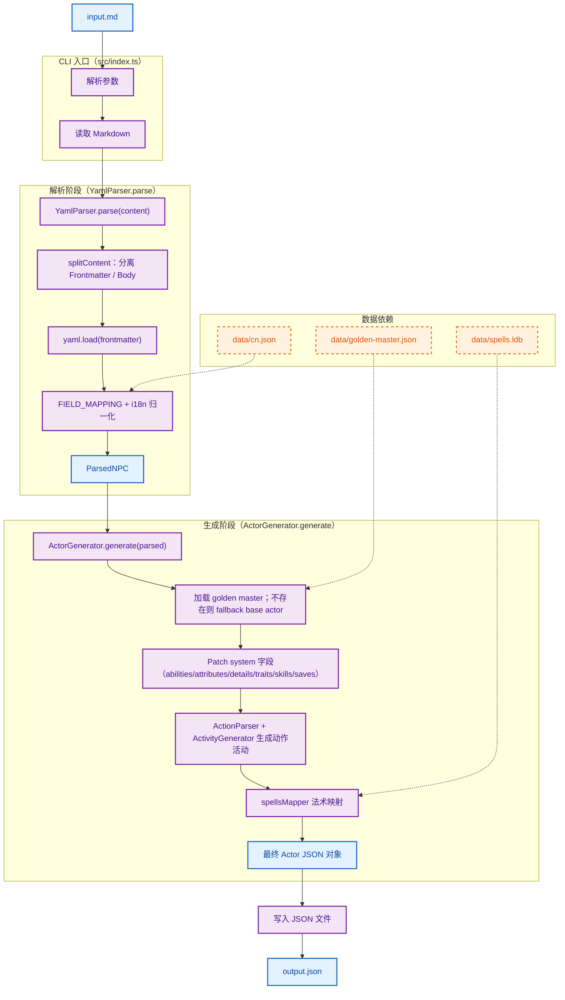

# FVTT 转换流程图

```mermaid
flowchart TB
    classDef file fill:#e3f2fd,stroke:#1565c0,stroke-width:2px,color:#0d47a1
    classDef process fill:#f3e5f5,stroke:#7b1fa2,stroke-width:2px,color:#4a148c
    classDef data fill:#fff3e0,stroke:#ef6c00,stroke-width:2px,stroke-dasharray: 5 5,color:#e65100

    InputFile["input.md"]:::file
    OutputFile["output.json"]:::file

    subgraph DataDeps["数据依赖"]
      CN["data/cn.json"]:::data
      GM["data/golden-master.json"]:::data
      SP["data/spells.ldb"]:::data
    end

    subgraph Entry["CLI 入口（src/index.ts）"]
      CLI["解析参数"]:::process
      ReadMd["读取 Markdown"]:::process
    end

    subgraph Parse["解析阶段（YamlParser.parse）"]
      ParseCall["YamlParser.parse(content)"]:::process
      Split["splitContent：分离 Frontmatter / Body"]:::process
      YamlLoad["yaml.load(frontmatter)"]:::process
      MapNorm["FIELD_MAPPING + i18n 归一化"]:::process
      Parsed["ParsedNPC"]:::file
    end

    subgraph Gen["生成阶段（ActorGenerator.generate）"]
      GenCall["ActorGenerator.generate(parsed)"]:::process
      LoadBase["加载 golden master；不存在则 fallback base actor"]:::process
      Patch["Patch system 字段（abilities/attributes/details/traits/skills/saves）"]:::process
      Actions["ActionParser + ActivityGenerator 生成动作活动"]:::process
      Spells["spellsMapper 法术映射"]:::process
      FinalActor["最终 Actor JSON 对象"]:::file
    end

    Write["写入 JSON 文件"]:::process

    InputFile --> CLI --> ReadMd --> ParseCall
    ParseCall --> Split --> YamlLoad --> MapNorm --> Parsed
    Parsed --> GenCall --> LoadBase --> Patch --> Actions --> Spells --> FinalActor --> Write --> OutputFile

    CN -.-> MapNorm
    GM -.-> LoadBase
    SP -.-> Spells
```
