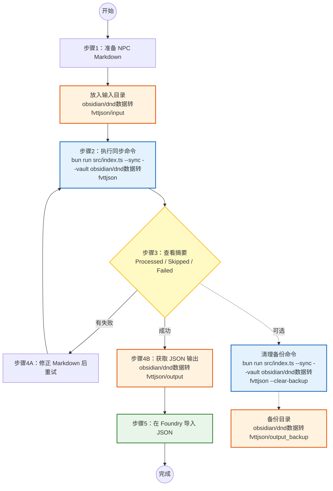

# 使用流程图（批量同步）

```mermaid
flowchart TD
    classDef folder fill:#fff3e0,stroke:#e65100,stroke-width:2px;
    classDef command fill:#e3f2fd,stroke:#1565c0,stroke-width:2px;
    classDef decision fill:#fff9c4,stroke:#fbc02d,stroke-width:2px;
    classDef success fill:#e8f5e9,stroke:#2e7d32,stroke-width:2px;

    Start((开始)) --> S1[步骤1：准备 NPC Markdown]
    S1 --> InputDir["放入输入目录<br/>obsidian/dnd数据转fvttjson/input"]
    class InputDir folder

    InputDir --> SyncCmd["步骤2：执行同步命令<br/>bun run src/index.ts --sync --vault obsidian/dnd数据转fvttjson"]
    class SyncCmd command

    SyncCmd --> Check{步骤3：查看摘要<br/>Processed / Skipped / Failed}
    class Check decision

    Check -- 有失败 --> Fix[步骤4A：修正 Markdown 后重试]
    Fix --> SyncCmd

    Check -- 成功 --> OutputDir["步骤4B：获取 JSON 输出<br/>obsidian/dnd数据转fvttjson/output"]
    class OutputDir folder

    OutputDir --> Import[步骤5：在 Foundry 导入 JSON]
    class Import success
    Import --> End((完成))

    Check -. 可选 .-> ClearCmd["清理备份命令<br/>bun run src/index.ts --sync --vault obsidian/dnd数据转fvttjson --clear-backup"]
    class ClearCmd command
    ClearCmd -.-> BackupDir["备份目录<br/>obsidian/dnd数据转fvttjson/output_backup"]
    class BackupDir folder
```
